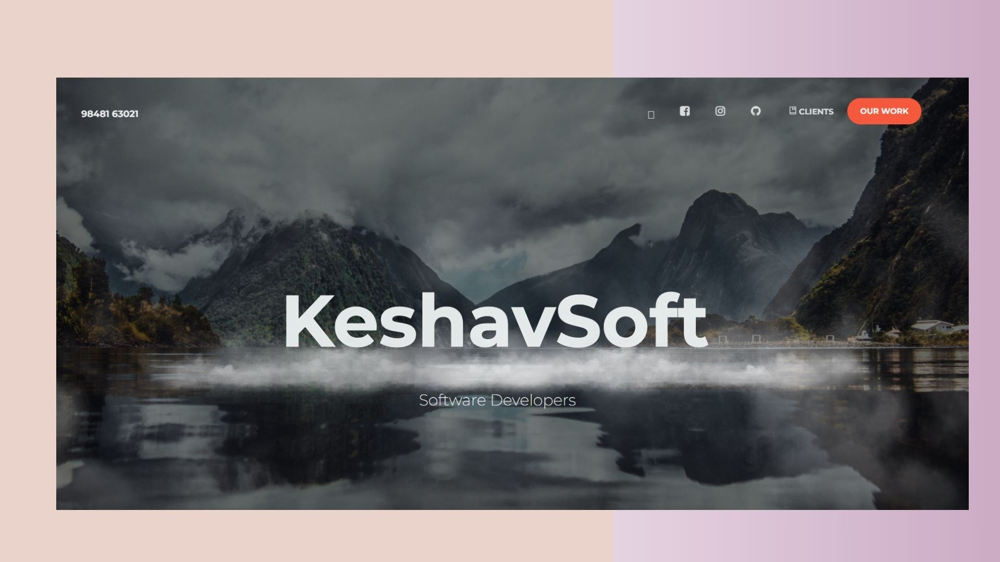

# crudBD
generate backend and database from json schema

<h1 align="center" color="#0000FF">crudBD</h1>

[](https://keshavsoft.com/)

## **Table of Contents** 📚
- [Overview](#Overview)
- [Installation](#installation)
- [BackEnd Only](#BackEnd)
- [Folder Structure](#folder-structure)
- [Purpose of the Project](#purpose-of-the-project)
- [Important Points](#important-points)
- [advanced installation](#advancedinstallation)
- [end points testing](#testendpoints)
- [visual studio code extensions](#vscodeextensions)
 
#### **Key Locations** 
- **Backend:** root:bin, root:binSecured ( for jwt protected end points same as bin ), root:binV2 for new branched End points
- **Database:** root:KData/JSON
- **Columns Schemas definition location :** root:KCode/DataSchema
- **Table Schemas definition location :** root:KCode/TableSchema
- **Table Schema to be considered :** root:KData/Config.json:ToDataDetails.DataPk
- **Frontend :** root:public

### <a name="advancedinstallation"></a>## **advancedinstallation** 🚀
- git clone https://github.com/keshavsoft/FrontEndByVite and keep in this location only
- keep the needed value KCode/Config.json : ToDataDetails.DataPk, from KCode/DataSchema and KCode/TableSchema
- FrontATSubTableSideBar.bat
- node app
  
#### **run the below commands to generate them** 
- **Backend:** run KCode/Backend.js
- **Database:** run KCode/Database.js
- **Frontend:** run npm run home

#### **run the batch files for windows** 
- **Batch File:** run fbd.bat

#### **run the below commands to see the output** 
- run npm run start

### <a name="overview"></a>## **Overview** 🔎
This project focuses on automating crudBD operations for JSON files, making it easy to manage and manipulate data. It offers a user-friendly interface for performing essential actions on JSON files, such as creating, reading, updating, and deleting records.
#### **Key Features** 
- **Dynamic Schema Handling:** Define table schemas using JSON files and dynamically generate crudBD operations.
- **Cross-Platform Compatibility:** Compatible with Windows, Mac, and Linux operating systems.
- **Effortless Setup:** Use provided batch files for Windows or simple commands for other OS to set up the project quickly.
- **Automatic Frontend Setup:** Automatically creates a frontend codebase in the public/JsoncrudBD directory.
#### **Technologies Used** 
- **Node.js:** Leveraging the power of JavaScript on the server-side.
- **Express.js:** A minimal and flexible Node.js web application framework for building robust APIs.
- **SQLite:** A lightweight, file-based database for efficient data storage.
- **npm:** The package manager for Node.js used for installing project dependencies.

### <a name="installation"></a>## **Installation** 🚀

1. Create a folder and navigate into it using the command prompt.

2. Clone the repository
   ```
   
   git clone https://github.com/keshavsoft/crudBD
   
   ```
3. Change Directory to crudBDGenByPath or Open the cloned folder, navigate to crudBD, and open the command prompt.
   ```
   
    cd crudBD
   
   ```
4. Create .env in the root location, and the below line to that file
   ```
   
    PORT=7019
   
   ```
5. Run the batch file (For Windows)
   ```
   
   fbd.bat
   
   ```
   This Above Command runs the following in Windows
   ``
   npm i and node KCode/EntryFile.js
   ``
   
    For Mac or Linux:
      ``
        chmod +x boilerplate.sh and sh boilerplate.sh
     ``
   
 5. For Executing:
   
   ```
   
      npm run start
   
   ```
### <a name="BackEnd"></a>## **BackEnd** 🚀

1. Delete all the folders starting with bin ( which is the BackEnd code).

2. run the KCode/Backend.js
   
3. Now all the bin folders only are created ( which is the BackEnd code).

### <a name="folder-structure"></a>## **Folder Structure**

```plaintext
├── KCode/
│   └── EntryFile.js
├── public/
│   └── JsoncrudBD/
│       └── bin/
│           └── (frontend code)
├── KData/
│   └── JSON/
│       └── 316/
│           └── data.db
├── FromTableColumns/
│   └── customers.json
├── FromData/
│   └── (JSON files)
├── bin/
│   └── (backend code)
├── BoilerPlate.bat
├── boilerplate.sh
├── package.json
├── .env
└── README.md
```

Database location :

KData/JSON

### <a name="purpose-of-the-project"></a>## **Purpose of the Project** 🎯
The primary objective is to simplify the process of managing and interacting with JSON files. By automating crudBD operations, this project aims to enhance efficiency and reduce the complexity of handling JSON data.
### <a name="important-points"></a>## **Important Points** 
Date: 24 Jan 2024
Stopped using encrypted SQLite database due to the unavailability of npm modules and limited knowledge within the team.

advanced users
follow the below steps also

create .env file
KS_SECRET_FORLOGIN=9848163021

from Keshav

table name : Users, is needed for user management

13Feb2023 

ready with only flat json 

if want to run the repo without npm 

BoilerPlate.bat -npm 

the below steps avoids, npm installation, there by saving internet bandwidth.

Follow Installation steps 1, 2, 3 then 

4. Run the batch file (For Windows)
   ```
   
   BoilerPlate.bat -npm
   
   ```
   
 5. For Executing:
   
   ```
      npm run start
   ```

Purpose of this project

at the root location KCode

DataSchema define your schema

crudBDGenerator/Config.json is the configuration file

the meaning of the repo

crudBD    ``crudBD ``<br>
Gen     ``Generate`` <br>
FBD     ``Frontend, Backend and Database`` <br>
All       ``Selection at 3 stages`` <br>

UI or FrontEnd repository ``https://github.com/keshavsoft/UiAsHtml``


for Source only (src), to test the application 

1. Create a folder and navigate into it using the command prompt.

2. Clone the repository
   ```
   git clone https://github.com/keshavsoft/crudBD
   ```
3. Change Directory to crudBDGenByPath or Open the cloned folder, navigate to crudBD, and open the command prompt.
   ```
    cd crudBD
   ```
4. Run the batch file (For Windows)
   ```
   Simple.bat
   ```
 5. For Executing:
   ```
      npm run dev
   ```

24 Feb 2024

added support for reference or foreign key of the database, and tested it with 320 in sqlite

in kcode config.json is keep in kcode root for much more cleaner look of the code


for mock testing the end points:

### <a name="vscodeextensions"></a>## **visual studio code extensions** 🚀

for est client or http calling

https://marketplace.visualstudio.com/items?itemName=humao.rest-client

code runner for executing batch files and js files

https://marketplace.visualstudio.com/items?itemName=formulahendry.code-runner


for Backend :

root : bin folder the code is generated from 

when running the file from kcode/Backend.js

for Database :

root : KData/JSON folder the code is generated from 

when running the file from kcode/Database.js

it takes the configuration file ( config.json )

and it takes the data path also from that file only

28 Feb 2024

5 March 2024 

for Database 
Mysql dosent have a datatype named NUMBER

We have covered the below datatypes

STRING
INTEGER
NUMBER ( converted to INTEGER )
DATE

Databases covered

Flat JSON
SQLite
Mysql
Postgres
MongoDB

errors can occur for mysql2 npm package for python
sqlite3 npm also error can come

16jun 2024 

finished ui with nice admin

https://github.com/hacktheme/Nice-Admin

now trying to integrate mazer

https://github.com/zuramai/mazer

limitations

1. never use - for any names

for developers

backend : bin

database : KData

frontend : publicDir/bin
